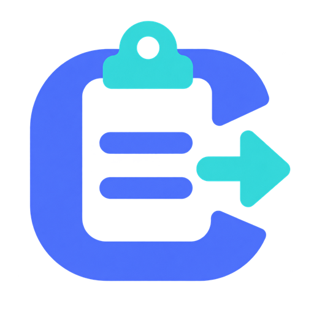

# CopyCop für das Waveshare RP2040-Keyboard-3

<p align="center">
  
</p>

CopyCop speichert Text von Windows, macOS oder Linux und tippt ihn später an
einem anderen Computer als normale USB-Tastatur. Es gibt keine automatische
Ausgabe beim Einstecken: Jede Ausgabe muss an den drei physischen Tasten des
Geräts gestartet werden.

## Kapazität

Das aktuelle Format fasst **126.464 UTF-8-Bytes**. Die mögliche Zeichenzahl
hängt deshalb vom Text ab:

- bis zu 126.464 ASCII-Zeichen (`A-Z`, Zahlen, übliche Codezeichen),
- bis zu 63.232 Umlaute wie `ä`,
- bis zu 42.154 Eurozeichen `€`,
- bei gemischtem Text einen Wert dazwischen.

Die CopyCop-GUI zählt live Zeichen und tatsächliche UTF-8-Bytes, zeigt freie
Kapazität und nicht unterstützte Zeichen und blockiert einen zu großen
Transfer. Ein übergroßer Text kann Unicode-sicher an Zeilen- oder Wortgrenzen
aufgeteilt werden. Das Gerät speichert weiterhin **einen ausgewählten Teil zur
Zeit**; die übrigen Teile bleiben in der App und können später einzeln geladen
werden. Nichts wird still abgeschnitten. Für den aktuellen Text zeigt die GUI
außerdem die geschätzte Tippdauer bei allen acht Geschwindigkeitsstufen an.

## Die drei Tasten

| Taste | Normalbetrieb | LOAD-Modus | AFK-Modus |
|---|---|---|---|
| links (`Ctrl`) | langsamer, auch während der Ausgabe | ohne Funktion | zusammen mit C: genau einmal tippen |
| Mitte (`C`) | schneller, auch während der Ausgabe | Zwischenablage übernehmen und speichern | Endloswiederholung starten |
| rechts (`V`) | Text tippen; erneut drücken = abbrechen | ohne Funktion | Wiederholung sofort stoppen |

Die Beschriftungen `Ctrl`, `C` und `V` beschreiben nur die Tastenkappen. Es
wird kein einzelnes `C`, `V` oder `Ctrl` an den Ziel-PC gesendet. Auch C oder V
auf der Laptop-Tastatur lösen CopyCop nicht aus.

Beim Einstecken wählt eine gehaltene Gerätetaste den Modus:

- keine Taste: grüner Normalbetrieb,
- nur die linke Strg-Taste: violetter AFK-Modus,
- mittlere C-Taste: blauer LOAD-Modus,
- alle drei Tasten: weißer Firmware-Update-Modus.

## Programme

### Grafische Oberfläche

Die GUI läuft ohne Konsolenfenster und verbindet sich automatisch mit CopyCop
im blauen LOAD-Modus. Man kann Text direkt einfügen, aus der
System-Zwischenablage holen, prüfen, aufteilen und den gewünschten Teil
speichern. Ein Druck auf die physische C-Taste liest ebenfalls die aktuelle
Zwischenablage; passt sie vollständig, wird sie direkt übertragen.

Die GUI kann für diese Zielsysteme veröffentlicht werden:

- `win-x64/CopyCop.exe`
- `linux-x64/CopyCop`
- `osx-x64/` für Intel-Macs
- `osx-arm64/` für Apple-Silicon-Macs

### Kommandozeile

Die bisherige CLI bleibt erhalten und verwendet denselben plattformübergreifenden
Core:

```text
copycop-cli [--replace-unsupported] [--part N] [--once]
```

Sie wartet auf C, bewertet Zeichen und Bytebelegung und fragt bei einem zu
großen Text interaktiv nach der Aufteilung und Teilnummer. Die CLI kann für
dieselben Systeme gebaut und veröffentlicht werden.

Unter Linux benötigt die CLI für den Zwischenablagezugriff `xsel`. GUI und CLI
benötigen Zugriff auf `/dev/hidraw`; die Regel
`host/linux/99-copycop.rules` kann nach `/etc/udev/rules.d/` kopiert und danach
mit `udevadm control --reload-rules` aktiviert werden.

## Neue Firmware installieren

Zuerst die Firmware selbst bauen oder eine veröffentlichte `copycop.uf2`
herunterladen. Danach:

1. CopyCop abziehen.
2. Alle drei mechanischen Tasten gedrückt halten und USB einstecken.
3. Loslassen, sobald das Laufwerk `RPI-RP2` erscheint.
4. Die erzeugte `copycop_firmware.uf2` beziehungsweise heruntergeladene
   `copycop.uf2` auf dieses Laufwerk kopieren.
5. Das Laufwerk verschwindet automatisch und CopyCop startet neu.

Der versteckte BOOT-Knopf ist nur die Notlösung, falls keine funktionsfähige
CopyCop-Firmware mehr startet. Für LOAD und den normalen Betrieb wird er nicht
benötigt.

## Text laden und ausgeben

1. CopyCop abziehen.
2. Mittlere Taste C gedrückt halten, einstecken und bei blauem Licht loslassen.
3. CopyCop-GUI oder `copycop-cli` starten.
4. Text in der GUI einfügen und auf „speichern“ klicken – oder Text normal
   kopieren und am Gerät C drücken.
5. Nach der grünen Bestätigung abziehen.
6. Am Ziel-PC ohne gedrückte Taste einstecken und deutsches Tastaturlayout
   auswählen.
7. Cursor platzieren und rechts V drücken. Ein zweites V bricht sofort ab.

Im TARGET-Modus besitzt CopyCop genau eine USB-Schnittstelle: eine
Standard-HID-Tastatur. Es gibt dort weder Laufwerk noch COM-Port,
Konfigurationsschnittstelle oder Netzwerkgerät. Der Ziel-PC braucht kein
Programm und keinen zusätzlichen Treiber.

## Geschwindigkeit und Zeichen

Im Normalbetrieb stehen `5, 25, 50, 100, 250, 500, 750, 1000 ms` zur Auswahl;
`5 ms` ist die Werkseinstellung. C macht schneller, Strg macht langsamer. An
der schnellsten beziehungsweise langsamsten Grenze bleibt die Einstellung
stehen. Beide Tasten können auch während des Tippens verwendet werden; die
neue Stufe gilt ab dem nächsten Zeichenabstand und wird nach Ende oder Abbruch
der Ausgabe dauerhaft gespeichert. Die Auswahl bleibt nach dem Abziehen
erhalten.

Die Tippdauer in der GUI berücksichtigt pro HID-Tastenfolge die gewählte Pause,
die Haltezeit und die längere gestaffelte Ausgabe von AltGr-Zeichen. Sie ist
eine sehr genaue Schätzung; Betriebssystem, USB-Weiterleitung und Zielprogramm
können noch geringe zusätzliche Verzögerungen verursachen.

### AltGr-Zeichen

Der normale Zielmodus bildet AltGr-Zeichen wie `{`, `}`, `|`, `@`, `€`, `[` und
`]` als physischen Tastendruck nach: echtes rechtes Alt wird zuerst gedrückt,
dann folgt mit Abstand das Zeichen, anschließend werden Zeichen und AltGr
getrennt losgelassen. Das verhindert, dass kurze USB-Berichte den Modifier
verlieren. Ein zusätzlicher Zielmodus ist dafür nicht nötig.

## AFK-Modus

1. Text zuerst wie oben beschrieben im blauen LOAD-Modus speichern.
2. CopyCop abziehen.
3. Nur die physische Strg-Taste halten, USB einstecken und bei violettem Licht
   loslassen.
4. C drücken, um den gespeicherten Text wiederholt zu tippen.
5. V drücken, um die Ausgabe sofort zu stoppen.

Physisches Strg+C startet stattdessen genau einen Durchlauf und stoppt danach.
Bei beiden AFK-Arten wird für jeden Tastenabstand zufällig einer der acht Werte
`5, 25, 50, 100, 250, 500, 750, 1000 ms` gewählt. Bei der Endlosschleife wird
auch die Pause zwischen zwei vollständigen Texten zufällig aus diesen Werten
gewählt. CopyCop fügt selbst keinen Zeilenumbruch oder Trenner hinzu.

Unterstützt werden deutsches QWERTZ, Umlaute, `ß`, Zeilenumbrüche, Tabulatoren
und übliche Code-Sonderzeichen. Typografische Anführungszeichen, Apostrophe,
Gedankenstriche und geschützte Leerzeichen werden normalisiert. Unbekannte
Zeichen wie Emojis blockieren den Transfer standardmäßig und können optional
durch `?` ersetzt werden.

## Sicherheit

CopyCop gibt gespeicherten Text wie eine echte Tastatur in das aktuell
fokussierte Fenster ein. Vor V, C im AFK-Modus oder Strg+C deshalb immer das
richtige Zielfenster und den Cursor prüfen. Der LOAD-Transport besitzt keine
Benutzeranmeldung oder Verschlüsselung; Passwörter und andere Geheimnisse
sollten nicht dauerhaft auf dem Gerät gespeichert werden.

## Entwickeln und testen

Firmware: Pico SDK 2.3.0, CMake 3.20+, Ninja und ARM-GCC.

```powershell
$env:PICO_SDK_PATH = 'C:\path\to\pico-sdk'
cmake -S firmware -B firmware/build -G Ninja
cmake --build firmware/build
```

Host-Projekte benötigen .NET 8 oder neuer:

```powershell
dotnet build host/CopyCop.Gui/CopyCop.Gui.csproj -c Release
dotnet build host/copycop-cli/copycop-cli.csproj -c Release
dotnet run --project tests/CopyCop.Cli.Tests -c Release
```

Alle fertigen Hostpakete inklusive Logo, eigenständiger GUI und `copycop-cli`
lassen sich unter Windows reproduzierbar erzeugen:

```powershell
powershell -File host/packaging/publish.ps1
```

Die Ergebnisse liegen anschließend unter `host/release/packages/`; dieser
generierte Ordner wird nicht in Git eingecheckt.

Technische Details: [Architektur](docs/architecture.md),
[Pinbelegung](docs/pinout.md), [Flash-Aufteilung](docs/flash-layout.md) und
[Teststand](docs/phases.md). Drittanbieter-Lizenzen stehen in
[`host/THIRD-PARTY-NOTICES.md`](host/THIRD-PARTY-NOTICES.md).
